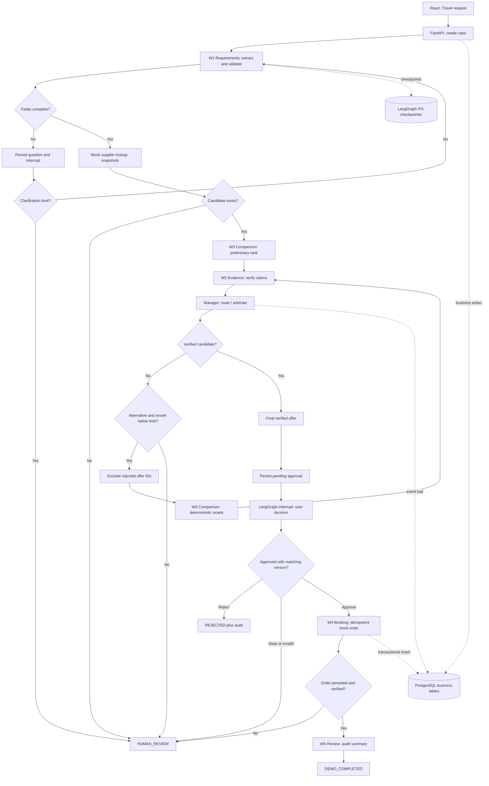
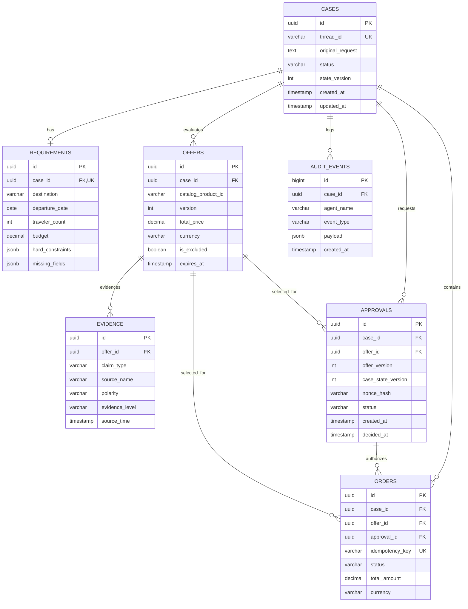

# CareTrip Ops — Hackathon PoC Technical Specification and Codex Implementation Brief

**Version: V3.0 · 2026-10-09 · Language: English (including code and API contracts)**  
**Status: Normative design specification; NOT yet implemented, deployed, or tested**  
**Audience: Codex or an independent developer with no previous conversation context**  
**Objective: Deliver a working project at the ZEIL Hackathon and produce verifiable engineering experience for future AI application/agent development roles.**

> **Primary instruction:** Treat this document as the single source of implementation truth. The three accompanying PNG diagrams represent earlier designs to be audited, not specifications that must be copied literally. Where they disagree with this document, follow the **corrected decisions** and **acceptance criteria** here. Never fabricate implemented functionality, accuracy metrics, genuine supplier evidence, real transactions, or successful payments.

---

## 0. Project overview, constraints, and definition of success

**Product:** CareTrip Ops — Evidence-Aware Travel Agent  
**One-liner:** A travel-agency customer-service prototype that converts vague travel requests into evidence-checked offers, arbitrates contradictory supplier claims, and creates a **simulated** reservation only after explicit user approval.

**Example request:** “I want to travel for three days with two friends, with a budget of CNY 3,000. Nothing too tiring, a convenient hotel, preferably with a lift.”

**Essential differentiator:** The inexpensive Hotel A advertises elevator access, but evidence contradicts its accessibility across guest floors. Evidence Worker flags the conflict; Manager prevents Hotel A from being offered as meeting the hard constraint; Comparison Worker reranks while excluding A and recommends Hotel B; user approves; the system creates exactly one idempotent mock order and displays the real recorded execution timeline. **Do not pass off an LLM's unsupported assertions as cross-source evidence verification.**

**Competition constraints:** This is a solo submission, with a newly created repository and all code, testing, video, and submission completed before 16:00 on 9 October 2026. The under-three-minute video must show the submitter's face. Use only free or already available model API capacity; do not require a paid service for the demo. Coding assistants are allowed. You may draw on ideas from the earlier GOAI team design, but independently implement this project and disclose inherited concepts in the README. This document does not independently confirm all external competition rules; verify final submission and bonus terms.

**Explicitly excluded:** Real payments, actual ticket issuance and supplier inventory, production authentication, automated SMS/email, real IDs and card details, RocketMQ, Higress, Celery, four standalone MCP servers, complete RAG, pgvector, microservices, high concurrency, and six autonomous LLM-powered agents.

**P0 success:** The end-to-end path works: React → FastAPI case creation → real LangGraph execution → PostgreSQL persistence → evidence conflict and reranking → human approval → idempotent simulated reservation → execution trace. At least six deterministic tests; reproducible `docker compose up --build` local startup; seeded demo data; recorded video; on-time submission. Public hosting is optional and must not jeopardize the core demo.

---

## 1. Cross-audit of the three supplied diagrams

### 1.1 Diagram identities

| ID | Original filename | Contents | Purpose |
|---|---|---|---|
| A | `CareTrip AI Travel System Architecture(1).png` | Layered architecture: React, FastAPI, Manager + 5 Workers, tools, PostgreSQL, Docker | Component and interaction scope |
| B | `mermaid-diagram (1).png` | ERD: CASES, REQUIREMENTS, OFFERS, EVIDENCE, APPROVALS, ORDERS, AUDIT_EVENTS | Preliminary data relationships |
| C | `mermaid-diagram.png` | Agent flowchart: clarification, product lookup, evidence checking, arbitration, HITL, mock booking | Preliminary control-flow branches |

### 1.2 Detected discrepancies and required fixes

| # | Original inconsistency / risk | Severity | Authoritative correction |
|---|---|---|---|
| 01 | A draws Manager dispatching to all five Workers, while C uses conditional routes and sequential dependencies. | High | Manager is a **constrained Supervisor routing node** driven by Case State. No unrestricted parallelism, infinite autonomy, or skipping Evidence/HITL. |
| 02 | A places Evidence and Comparison in parallel, while C compares before verifying; an unverified option might appear as a final recommendation. | High | **Candidate discovery → preliminary ranking → evidence checking → arbitration → verified final recommendation**. Mark preliminary and verified/final options distinctly in UI. |
| 03 | C loops to comparison without an exclusion set, potentially selecting rejected Hotel A again indefinitely. | High | Persist `excluded_offer_ids`; rejected offers cannot reappear. Set `rerank_count <= 1`; otherwise `HUMAN_REVIEW`. |
| 04 | B has `blocking` and `evidence_level`, whereas A shows only strong/weak/missing. | High | Define `STRONG / WEAK / MISSING / CONFLICTING` and `PASS / BLOCK / REVIEW`. Weak evidence cannot automatically establish an accessibility claim. |
| 05 | B has per-case OFFERS without immutable snapshot version or expiry, so a price may change after approval. | High | Immutable offer snapshots with `version`, `expires_at`, `currency`, and `price`. Approval binds `offer_id`, `offer_version`, and `case_state_version`; validate before booking. |
| 06 | B APPROVALS lacks a created timestamp and pending state. | High | Add `PENDING / APPROVED / REJECTED / EXPIRED`, `created_at`, nullable `decided_at`, associated snapshot, and nonce. |
| 07 | A shows PG checkpoints while C suggests loosely coupled writes; neither guarantees atomic transactions between graph state and business records. | High | Business DB is the source of truth; `AsyncPostgresSaver` stores graph checkpoints separately, ideally in a separate schema. Do not claim one atomic transaction across the two systems. |
| 08 | C places HITL before booking but does not describe replay: LangGraph may re-enter an interrupted node. | High | Keep `interrupt()` in a no-side-effect node, booking in a separate node; use idempotency keys/UPSERT/version checks for all side effects. |
| 09 | A says “mock order succeeded,” C says `DEMO_COMPLETED`, but old GOAI `CLOSED` implied payment, ticketing, and reconciliation. | High | Only `SIMULATED_CONFIRMED` and `DEMO_COMPLETED`; never imply `PAID`, `TICKETED`, or production `CLOSED`. |
| 10 | A names `/api/approvals`, `/api/orders`, etc., without contracts in C. | Medium | Implement the API contracts and repeat-request behavior specified in §6. |
| 11 | A mentions SSE/WebSocket as alternatives; implementing both wastes time. | Medium | If time permits, only SSE; P0 may poll every second. Read ordered events from PG; no WebSocket. |
| 12 | B EVIDENCE cannot fully capture source-by-source claims, freshness, and counterevidence. | Medium | One evidence row per source/claim/offer; add `polarity` and `source_time`. Store aggregate verdict separately or as an offer assessment. |
| 13 | B makes OFFERS children of Case but may conflate source catalog products with case-specific offers. | Medium | `mock_catalog.json` is read-only seed input; create immutable case-specific Offer Snapshots with separate IDs. |
| 14 | A depicts a microphone and several user roles without ASR or authentic authorization. | Medium | P0 supports **text input and a demo actor only**. Do not present microphone, adult-child delegation, or RBAC as implemented. |
| 15 | A places optional object storage alongside PG although OSS/MinIO is not implemented. | Low | Read repository-local `data/*.json`; store real business data in PostgreSQL. |
| 16 | C invokes Review on success only and omits consistent auditing for rejection/manual review. | Medium | All terminal outcomes write `audit_events`. Review summarizes successful cases; other outcomes get a deterministic closing summary. |
| 17 | B foreign keys do not guarantee Approval's Case and Offer refer to the same case. | High | Validate `offer.case_id == approval.case_id == order.case_id` in services, with constraints/transactions where practical. |
| 18 | No branch for unavailable LLM, exhausted budget, timeouts, or invalid JSON. | High | Explicit deterministic `MODEL_MODE=mock_llm`, real API mode, and safe error/manual review when calls fail. Never silently claim mock inference was real. |
| 19 | Background case execution and SSE may be lost on disconnect or API restart. | Medium | Single-process demo-only runner with in-memory active-task registry and PG events; refresh reads DB. Restart requires explicit/manual checkpoint-based recovery; no production guarantees. |
| 20 | Docker Compose can run locally but does not by itself create a hosted website. | Medium | Compose guarantees local three-service startup only. Hosted bonus requires separately configured public frontend, API, and managed PG with pricing/sleep restrictions verified. |

**Guiding principle:** Retain A's layers, B's core entities, and C's conditional workflow, but repair state consistency and reduce inference/tooling scope rather than adding more frameworks.

---

## 2. Corrected normative system architecture

### 2.1 Layers

1. **Presentation:** React + TypeScript + Vite; `CaseCreateForm`, `AgentTimeline`, `OfferCompare`, `EvidencePanel`, `ApprovalPanel`, `MockOrderPanel`. Show only API-confirmed outcomes. Never expose the model API key to the browser.
2. **API:** Python 3.11+, FastAPI, Pydantic v2. Case creation, status, offer/evidence, approval, and trace APIs. Use predefined demo identity only; do not claim production identity controls.
3. **Orchestration:** LangGraph `StateGraph`, Manager router plus five business worker roles. Invoke models through LangChain chat models. **At most two nodes need the LLM; the others are deterministic.** This is not a team of six independently autonomous LLM agents.
4. **Skills/Adapters:** Read-only sample catalog, evidence comparison, rules engine, offer normalization, ranking, simulated inventory and bookings. No standalone MCP service in P0. Use typed, testable function contracts which could later be exposed via MCP.
5. **Persistence:** PostgreSQL 16+ (or a confirmed compatible stable version), SQLAlchemy 2.x, psycopg, and Alembic for business tables. LangGraph `AsyncPostgresSaver` owns its own checkpoint tables; never manually design them.
6. **Observability:** `audit_events` stores business-readable steps; LangSmith optional, never a local prerequisite. Record node, outcome, elapsed time, call counts, provider-returned token usage, and error codes; omit chain-of-thought and private data.
7. **Deployment:** Three Docker Compose services: `web` (Vite build served via Nginx), `api` (FastAPI), and `db` (PostgreSQL) with a named DB volume, readiness/healthchecks, server-side secrets. Public deployment is P1.

### 2.2 Manager/Worker responsibilities and LLM use

| Role | Node | Inputs | Outputs | Model usage | Hard boundary |
|---|---|---|---|---|---|
| Manager | `manager_router`, `arbitrate` | Case State, outcomes, conflicts | Next worker/terminal state; arbitration reason code | None in P0 | Finite transitions; cannot bypass safety gates |
| W1 Requirements | `requirements` | User request and confirmed fields | Requirements, missing fields | One in real mode, zero in mock mode | Pydantic validation; do not invent necessary dates |
| W2 Evidence | `evidence` | Offer snapshots and evidence rows | Verdict and excluded IDs | 0 | Never label a claim verified when material sources conflict |
| W3 Comparison | `comparison` | Requirements, catalog, exclusions | Preliminary/final ranks and rationale | 0–1, optional | Deterministic price, expiry and hard-constraint filtering |
| W4 Booking | `booking` | Approved snapshot and key | Mock order and state | 0 | Validate approval/version/expiry/idempotency |
| W5 Review | `review` | Final event trail and outcome | Structured audit summary | 0 | No automatic production knowledge-base updates |

**Default model budget:** `MODEL_MODE=mock_llm` enables a wholly deterministic offline demo. Real API mode normally needs no more than two model calls (W1 required, W3 optional); conflict reranking remains Python-only. `MAX_LLM_CALLS_PER_CASE=3` (third call reserved for validation retry), `MAX_RERANKS=1`, `MAX_CLARIFICATIONS=2`, `LLM_TIMEOUT_S=20`, with `MAX_OUTPUT_TOKENS` configured for the provider. On exhaustion, record `MODEL_BUDGET_EXCEEDED` and route to human review; never claim success.

**Terminology:** “Agent” denotes a business responsibility. Technically this is hybrid agentic orchestration with LLM-driven and deterministic nodes. The README must not call it “six autonomous LLM agents.”

---

## 3. LangGraph state and complete business lifecycle

### 3.1 Logical CaseState

```python
class CaseState(TypedDict, total=False):
    case_id: str
    user_input: str
    requirements: dict
    missing_fields: list[str]
    clarification_count: int
    offer_snapshot_ids: list[str]
    preliminary_offer_id: str | None
    final_offer_id: str | None
    excluded_offer_ids: list[str]
    evidence_verdicts: dict
    rerank_count: int
    approval_id: str | None
    decision: str | None
    order_id: str | None
    status: str
    next_action: str
    llm_calls: int
    llm_input_tokens: int
    llm_output_tokens: int
    last_error: str | None
```

Only compact JSON-serializable state and business IDs belong in State. Large documents, detailed evidence, raw logs and full supplier texts stay in PostgreSQL/repository files and outside the prompt. `thread_id = case_id`. Business status is updated explicitly by the application; it is never inferred solely from graph checkpoint state.

### 3.2 Business state enumeration

`RECEIVED`, `EXTRACTING_REQUIREMENTS`, `NEEDS_CLARIFICATION`, `REQUIREMENTS_READY`, `OFFERS_DISCOVERED`, `EVIDENCE_REVIEW`, `EVIDENCE_CONFLICT`, `OFFERS_VERIFIED`, `AWAITING_APPROVAL`, `APPROVED`, `REJECTED`, `MOCK_BOOKING`, `SIMULATED_CONFIRMED`, `DEMO_COMPLETED`, `HUMAN_REVIEW`, `FAILED`.

- `DEMO_COMPLETED` is the success terminal state; `REJECTED`, `HUMAN_REVIEW`, `FAILED` are auditable alternative outcomes.
- `AWAITING_APPROVAL` requires both a pending approval record and LangGraph interruption. Resume requires matching approval nonce, case, offer and version.
- `NEEDS_CLARIFICATION` also interrupts. Exceed two clarification rounds → `HUMAN_REVIEW`.
- Never bypass Evidence to reach Approval for a claim requiring verification.

### 3.3 Normal and exceptional execution

- `start → requirements`. Missing fields → save question and `interrupt`; resume with the user's additional answer. Exceed clarification limit → `HUMAN_REVIEW`.
- Once complete, `supplier_lookup` creates immutable case-specific Offer Snapshots from read-only JSON sample catalog. Validate traveler count, price and explicit constraints.
- `comparison_initial` produces a **preliminary, not yet verified** ranking.
- `evidence` checks the claims needed for hard requirements against source rows: `STRONG`, recent and without relevant counterevidence → `PASS`. Conflicts, missing critical evidence, or insufficient proof → `BLOCK` or `REVIEW`. Evidence must be source-backed.
- `manager_arbitrate` adds unsafe options to `excluded_offer_ids`. Where alternatives exist and rerank budget remains, route through `comparison_final`; otherwise `HUMAN_REVIEW`. Even a compliant first candidate must undergo final ranking.
- Persist a PG `PENDING` approval **before** entering a separate side-effect-free node that performs `interrupt()`. The UI must disclose price, version and “simulation only.”
- Resume with `APPROVE/REJECT`. Rejection is audited and terminal. Approval checks the nonce, record status, snapshot/Case versions, amount and validity before setting `APPROVED`.
- `booking` derives a stable idempotency key from `case_id + approval_id + offer_version`, uses a unique constraint and atomic transaction/UPSERT, then re-reads the mock order. No real supplier or payment operations.
- `review` writes a structured summary and ends as `DEMO_COMPLETED`. Other terminal states also write audit records.
- On booking failure, safely retry once only if idempotent; otherwise `HUMAN_REVIEW`. Never invent confirmed bookings.

Hotel A must form the principal reproducible conflict demo. Also support: no-conflict success, missing fields, user rejection, unavailable offers, and duplicate approval/booking.

### 3.4 Authoritative Mermaid flowchart



**Flowchart interpretation:** `CLAR → REQ` means a client resumes the graph using `Command(resume=...)`; it is not an unattended retry loop. Persist the pending record in a separate step before the interrupt node. `RERANK → EVD` must validate the new candidate; exclusions remain in state.

---

## 4. Corrected PostgreSQL model and ERD

### 4.1 Tables and critical columns

Use `timestamptz` UTC for timestamps, `numeric(12,2)` for money, `char(3)` for currency, UUID for entity IDs. Avoid real personally identifying information. Use lowercase snake_case table names.

- **cases:** `id PK`, `thread_id UNIQUE NOT NULL`, `original_request`, `status`, `state_version int default 0`, `demo_actor`, `created_at`, `updated_at`. Increment `state_version` optimistically on approval-sensitive business changes.
- **requirements:** `id PK`, `case_id FK UNIQUE`, `origin`, `destination`, nullable `departure_date`, `duration_days`, `traveler_count`, `budget numeric`, `currency`, `hard_constraints jsonb`, `soft_preferences jsonb`, `missing_fields jsonb`, `updated_at`. Incomplete rows are permitted but cannot advance to offers.
- **offers:** `id PK`, `case_id FK`, `catalog_product_id`, `supplier_id`, `product_name`, `version int`, `total_price numeric`, `currency`, `details jsonb`, `evidence_status`, `is_excluded boolean`, `expires_at`, `source_updated_at`, `created_at`; unique `(case_id,catalog_product_id,version)`. Never mutate a created snapshot's price or supplier statements in place.
- **evidence:** `id PK`, `offer_id FK`, `claim_type`, `source_name`, `source_reference`, `source_time`, `polarity enum(SUPPORT/CONTRADICT/UNKNOWN)`, `evidence_level enum(STRONG/WEAK/MISSING/CONFLICTING)`, `detail`, `created_at`. Aggregate verdict belongs on an offer assessment or view, not falsely on each individual source row.
- **approvals:** `id PK`, `case_id FK`, `offer_id FK`, `offer_version`, `case_state_version`, `nonce_hash`, `status enum(PENDING/APPROVED/REJECTED/EXPIRED)`, `created_at`, nullable `decided_at`, `actor`. Validate offer/Case ownership; only one active PENDING approval per Case (partial unique index).
- **orders:** `id PK`, `case_id FK`, `offer_id FK`, `approval_id FK`, `idempotency_key UNIQUE NOT NULL`, `status enum(SIMULATED_CONFIRMED/FAILED)`, `total_amount`, `currency`, `created_at`. Do **not** add real `paid` or `ticketed` fields.
- **audit_events:** `id bigint generated always as identity PK`, `case_id FK`, `agent_name`, `event_type`, `status`, `payload jsonb`, nullable `duration_ms`, nullable `llm_input_tokens`, nullable `llm_output_tokens`, `created_at`. Append-only. `id` provides reliable SSE ordering/replay.

**Indexes:** `cases(status,created_at)`, `offers(case_id,is_excluded)`, `evidence(offer_id,claim_type)`, `approvals(case_id,status)`, `orders(case_id)`, `audit_events(case_id,id)`.

### 4.2 Authoritative corrected ERD



**Migrations:** Run `alembic upgrade head` for business tables; run `AsyncPostgresSaver.setup()` once in a dedicated startup initialization step (or with idempotent initialization checks). Do not add LangGraph internal checkpoint tables to the business ERD or manually define their schema.

### 4.3 Business/checkpoint consistency protocol

1. Business Case/Approval/Order records are authoritative; checkpoints recover execution progress, and there is no assumed cross-system atomic transaction.
2. Case creation: commit DB transaction → start graph execution → append event. If graph initialization fails, mark Case `FAILED` or provide an explicit retry path.
3. Approval: within a transaction use `SELECT FOR UPDATE` and/or optimistic version checks; allow exactly one `PENDING → APPROVED` transition, then resume the graph using its original `thread_id`.
4. Booking: in one business transaction validate approval, offer snapshot, expiry and amount, then UPSERT with a unique idempotency key. Existing key returns the original record.
5. Graph nodes may re-run after checkpoint recovery: all DB writes with side effects must be idempotent. Checkpoint status never proves that external DB operations committed.
6. If an order commits but checkpoint persistence fails, replay must find that order by its idempotency key and reuse it.

---

## 5. Mock data and business rules

### 5.1 Synthetic demonstration dataset

- **HOTEL_A:** Example package total **NZD 820** (the scope of included travel components must be explicit). Advertises `lift_available=true`, but floor access is incomplete. Synthetic sources: `official_site` mentions a lift without full-floor access (WEAK / SUPPORT), `guest_review` states that half a flight of stairs remains (CONTRADICT), and `support_ticket` contains a matching complaint (CONTRADICT). Aggregate `CONFLICTING`; block when elevator access is a hard requirement.
- **HOTEL_B:** **NZD 920**. Synthetic official amenity record asserts `lift_serves_all_guest_floors=true`, without contradictory sample evidence; verdict `PASS` **within the simulated supplier dataset only**. Never imply it is a verified real-world hotel fact.
- **HOTEL_C:** **NZD 880**. Information on floor coverage is missing; `MISSING → REVIEW`, not confirmed compliant.
- Standardize the demo destination on a short Auckland-area trip. The UI uses NZD. A Chinese request stating “3,000 yuan” must not silently be interpreted as NZD; clarify currency or explicitly choose an NZD sample scenario.

### 5.2 Hard business invariants

- With `elevator_required=true`, no offer without `PASS` may appear as a verified recommendation.
- Total price comes from PostgreSQL offer snapshot, never from model-generated numbers. Compare budget and offers only in the same currency; do not invent exchange rates.
- Missing evidence means “not established,” not “there is no elevator.” Blocking means the system cannot safely certify that candidate.
- Do not progress without necessary date, traveler count, or budget currency. Prefilled demo dates are acceptable only when disclosed.
- Mock booking needs a valid `APPROVED` record and consistent offer version, price and expiry.
- `rerank_count <= 1`; exceeding the limit leads to `HUMAN_REVIEW`.
- Log explainable decision summaries, evidence references and tool outputs, not hidden model reasoning.

---

## 6. FastAPI contract and frontend integration

**Standard response:** Success: `{"data": ..., "request_id": "..."}`. Failure: `{"error":{"code":"...","message":"...","retryable":false},"request_id":"..."}`. Times are ISO-8601 UTC; money is a JSON string to avoid JavaScript floating-point drift; IDs are UUID strings. Restrict CORS to explicit local/deployed origins.

| Method | Route | Responsibility | Expected response/behavior |
|---|---|---|---|
| GET | `/healthz` | Process liveness | 200 |
| GET | `/readyz` | DB and required components available | 200 or 503 |
| POST | `/api/cases` | Create Case and start controlled execution | 201 `{case_id,thread_id,status}`; input `request`, `demo_actor`; don't block through entire workflow |
| GET | `/api/cases/{id}` | Current Case phase | `{status,requirements,missing_fields,next_action,state_version}` |
| POST | `/api/cases/{id}/clarifications` | Answer missing fields; resume graph | `{answers:{...}}`; require clarification state/thread and enforce limit |
| GET | `/api/cases/{id}/offers` | Offer snapshots | Preliminary/verified labels, price, currency, version, evidence state |
| GET | `/api/cases/{id}/evidence` | Evidence details | Claim, source, time, polarity, aggregate verdict, conflict reason |
| GET | `/api/cases/{id}/approvals` | Current approval | `approval_id`, `nonce`, `offer_id`, `offer_version`, `status`; demo actor only |
| POST | `/api/cases/{id}/approvals/{approval_id}/decision` | HITL action | `decision=APPROVE/REJECT`, `nonce`, `expected_state_version`; idempotent repeat handling |
| GET | `/api/cases/{id}/orders` | Mock orders | `SIMULATED_CONFIRMED`, snapshot amount and time; `[]` if none |
| GET | `/api/cases/{id}/events` | Auditable execution events | `{id,agent_name,event_type,status,payload,created_at}`, ascending ID |
| GET | `/api/cases/{id}/events/stream` | SSE (P1) | SSE `id=audit_events.id` and `Last-Event-ID` replay; P0 may poll |

**Error status codes:** 400 invalid condition/format, 404 unknown case, 409 business state/version conflict, 422 invalid request schema, 429 application limit, 503 model unavailable. `APPROVE` with stale quote/version must produce `409 STALE_OFFER` and route to reapproval/manual review; never book the old quote.

**Long-running cases:** Hackathon uses `uvicorn --workers 1` and an in-memory active-task registry. Business and event states continuously persist in PG. This is demo-only: restart may require manual recovery and does not guarantee exactly-once queue execution. Optionally add an admin `POST /api/cases/{id}/resume`, permitted only when inactive and DB-validated. No multiple API replicas, Celery, or Redis Queue.

**SSE (optional P1):** Use version-supported `EventSourceResponse` or standard `StreamingResponse`, polling PG every 0.5–1 second and resuming from event IDs. No WebSocket.

### 6.1 React components

- `NewCasePanel`: input, conspicuous currency/budget note and single-click seeded demo request.
- `CaseStatusPanel`: current state/node, clear retry and failure information.
- `OfferComparison`: separate preliminary and verified final results; show snapshot version, source and expiry; only final verified offer may be approved.
- `EvidenceTimeline`: source-level SUPPORT/CONTRADICT and aggregate verdict, labeled as **synthetic sample evidence**.
- `ApprovalDialog`: price/currency/offer/version and **SIMULATION ONLY**, approve/reject loading and click protection. After network errors, GET the status rather than assuming failure/success.
- `AgentEventTimeline`: render actual PG `audit_events`; do not generate a fake visual timeline. Show Manager's reason for excluding Hotel A.
- `MockOrderResult`: show result only for `DEMO_COMPLETED`; no success page for rejected, failed or human-review cases.

Use `React + TypeScript + Vite + fetch API + simple CSS`. A minimal UI component library is optional, not required. Avoid Next.js, Redux, and elaborate state architecture. A case ID, light data-fetch hooks and local state are sufficient.

---

## 7. Recommended project structure

```text
caretrip-ops-poc/
  README.md
  .env.example
  .gitignore
  docker-compose.yml
  frontend/
    Dockerfile
    nginx.conf
    package.json
    src/
      main.tsx
      App.tsx
      api/client.ts
      types.ts
      components/{CaseForm,CaseStatus,OfferCompare,EvidencePanel,ApprovalPanel,EventTimeline,OrderResult}.tsx
  backend/
    Dockerfile
    requirements.txt  # or pyproject.toml + lock
    alembic.ini
    alembic/versions/
    app/
      main.py
      config.py
      api/{cases,offers,approvals,orders,events}.py
      db/{session,models,repositories}.py
      schemas/{api,case_state}.py
      graph/{builder,routing,nodes}.py
      agents/{requirements,evidence,comparison,booking,review}.py
      tools/{supplier_catalog,evidence_engine,ranking,mock_booking}.py
      services/{case_runner,approval_service,audit_service,llm_provider}.py
      data/{mock_catalog,mock_evidence}.json
    tests/{test_requirements,test_evidence,test_arbitration,test_approvals,test_idempotency,test_e2e}.py
```

Environment: `DATABASE_URL`, `MODEL_MODE=mock_llm|api`, `MODEL_PROVIDER`, `MODEL_NAME`, `LLM_API_KEY`, `MAX_LLM_CALLS_PER_CASE`, `MAX_RERANKS`, `LLM_TIMEOUT_S`, `FRONTEND_ORIGIN`, `DEMO_MODE=true`. Keys must stay server-side and out of Git. `.env.example` uses placeholders only. `git grep -E 'AIza|sk-|AIzaSy'` is an additional check but not a substitute for dedicated secret scanning.

---

## 8. Local deployment and operational validation

### 8.1 Docker Compose requirements

- `db`: PostgreSQL, named volume, `pg_isready` healthcheck; do not publish a DB port publicly. Optional localhost-only debug mapping: `127.0.0.1:5432:5432`.
- `api`: FastAPI; wait for DB readiness; run Alembic and checkpoint initialization; one Uvicorn worker; healthcheck.
- `web`: Serve compiled Vite output with Nginx; proxy `/api/` to `api:8000`, simplifying CORS. Publish `http://localhost:8080`.
- Use idempotent seeding (`seed_mock.py`) or read-only catalog JSON. Restart must not duplicate offers or Case records.
- Pin versions; do not use floating `latest` dependencies. Generate supported lockfiles/requirements for the build environment.

### 8.2 Commands and checks Codex MUST execute

1. `docker compose config` passes.
2. `docker compose up --build -d` starts all three healthy services.
3. `curl http://localhost:8080/` returns frontend HTML; `curl http://localhost:8080/api/readyz` reports ready.
4. Run `pytest -q` in the backend container; all tests pass.
5. Start a Hotel A conflict case; verify actual `EVIDENCE_CONFLICT`, `MANAGER_RERANK` events and the final exclusion of A.
6. Before approval, `GET orders` is empty; repeating approval with the same nonce still produces only one order.
7. Refresh the UI; reconstruct Case/Offer/Evidence/Approval/Order from API records.
8. `docker compose down && docker compose up -d` retains persisted Case, orders and events.
9. Initialization failures produce explicit errors, not misleading success logs.

**Do not fake public deployment** when credentials or a host are unavailable. Where possible, deploy web, API and a managed PG separately and smoke-test the public site; document free-tier cost, cold starts, and availability limitations. Local Compose success does not earn the hosted bonus by itself.

---

## 9. Test matrix and acceptance criteria

| ID | Scenario | Expected terminal state / assertions |
|---|---|---|
| T01 | Complete request, compliant Hotel B | `AWAITING_APPROVAL`, then `DEMO_COMPLETED`, exactly one mock order |
| T02 | Initial Hotel A top-ranked, contradiction about elevator floor access | `EVIDENCE_CONFLICT` → Manager excludes A → B rechecked → Approval; trace includes source and rationale |
| T03 | Missing departure date or currency | `NEEDS_CLARIFICATION`, zero orders, resume after answer |
| T04 | User rejects offer | `REJECTED`, orders=0, audit event created |
| T05 | No candidates with sufficient evidence on a hard constraint | `HUMAN_REVIEW`, zero verified offers/orders |
| T06 | Repeat APPROVE / replay request | One `APPROVED` transition and exactly one order with a unique idempotency key |
| T07 | Offer version/expiry changes after approval | `409 STALE_OFFER`; no old-offer booking |
| T08 | Evidence still conflicts after reranking | `rerank_count <= 1`, then `HUMAN_REVIEW`, never endless execution |
| T09 | Model produces invalid JSON, times out, or exhausts quota | Controlled error/manual review, error code logged, no synthetic output misrepresented as model inference |
| T10 | Failure writing checkpoint or business DB | No duplicate orders; reconcile replay against authoritative DB and log error |
| T11 | User refreshes React | API reconstructs the true current status; no component-only fabricated success |
| T12 | Local restart with PG volume | Cases/audit/orders retained; do not recreate an existing order |

**Demo acceptance:** Browser supports at least success, evidence-conflict, and rejection paths; timeline entries originate from real API/database events, not hardcoded animations. README must report actual test commands and accurate pass/fail counts. Only claim measured token costs or accuracies after running evaluations.

---

## 10. Timeline, priorities, and scope control

**P0 (mandatory):** Minimal Case API; React workbench; PG business tables and checkpoint; functioning LangGraph routes; synthetic offers/evidence; Manager conflict arbitration; at most one rerank; human approval; idempotent simulated order; trace timeline; essential tests; submission video.

**P1 (only if time remains):** SSE, UI polish, LLM token-usage display, hosted deployment bonus.  
**P2 (after event):** Recovery scheduling, MCP servers, real supplier APIs, RAG/pgvector, OAuth/RBAC, background queues, distributed execution, real reconciliation.

**Suggested implementation order:**

1. Docker, PostgreSQL, FastAPI skeleton, Alembic/health checks, basic React page.
2. Sample data, pure-Python Evidence/Comparison rules and unit tests before LLM work.
3. StateGraph, checkpoints, Case/Event persistence and conflict/rerank end-to-end.
4. Clarification and approval interrupts, REST resume, idempotent booking.
5. Wire React to the real backend. Prefer short polling first; SSE only if time remains.
6. Offline `mock_llm` regression; one real model smoke-test when API is available, recording usage/errors.
7. Record the under-three-minute face-on-camera video, update README and repository, and submit with a buffer.

**If behind schedule, cut in this order:** public deployment → SSE → complex Review → LLM-generated explanatory polish. Do not drop the Evidence conflict, no-booking-before-approval rule, real PostgreSQL writes, auditing, or video. If API capacity is unavailable, clearly label **Deterministic Demo Mode** in UI, README and video; do not claim live LLM use.

---

## 11. Standalone Codex execution instructions

> You are a senior Python AI/full-stack engineer. You only have `CARETRIP_POC_SPEC_EN.md` and three older PNG diagrams, with no previous conversation. Independently build a new `caretrip-ops-poc` repository following this document as the authoritative specification. First read the discrepancies in §1; do not copy conflicting diagram details over the corrections in this document. Build React/TypeScript/Vite + FastAPI + LangGraph/LangChain + PostgreSQL + Docker Compose.
>
> Before implementation, write a plan of ten steps or fewer and prioritize P0. Then actually create the implementation, schema migrations, automated tests and README; run every feasible test and local deployment command. Report only results actually observed, including commands and output. If keys, tools or platform access block a step, name the exact obstacle and use an explicitly labeled offline alternative; never fake a passing test, live API, or public deployment. Implement the constrained Manager, five worker roles, evidence-conflict exclusion and reranking, LangGraph HITL, PostgreSQL business records and checkpoints, idempotent approval and mock booking, and a React timeline powered by genuine backend events. Do not integrate payment, fabricate supplier evidence, or introduce unnecessary Java, RocketMQ or Higress. Preserve time for the video and submission.
>
> On completion provide: repository layout, startup instructions, environment variables, migration commands, API docs URL, actual test outcomes, measured model usage (if any), remaining limitations, and a change summary relative to the three original diagrams. In README disclose reused concepts from the older jointly designed GOAI CareTrip Ops proposal.

---

## 12. References and attribution of design changes

The original roles/components and draft data structures derive from the user's three diagrams. The problem audit, corrected contracts, lifecycle, test cases and deployment constraints are new technical design recommendations; they should not be attributed to the images as if already depicted.

- LangGraph interrupts and `Command(resume=...)`: https://docs.langchain.com/oss/python/langgraph/interrupts
- AsyncPostgresSaver: https://reference.langchain.com/python/langgraph.checkpoint.postgres/aio/AsyncPostgresSaver
- FastAPI SSE: https://fastapi.tiangolo.com/tutorial/server-sent-events/
- LangGraph Graph API and execution behavior: https://docs.langchain.com/oss/python/langgraph/graph-api

**Version warning:** Library imports and APIs can change; Codex must validate against the actually installed dependency versions rather than blindly copying outdated snippets.
