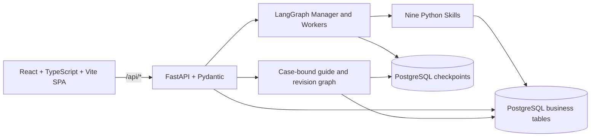

# CareTrip Ops V4.0 — Agentic Travel Service Platform for Seniors

**ZEIL Hackathon 2026 — Project** · Local demonstration · New Zealand scope

## Project overview

CareTrip is an **Agentic Travel Service Platform for Seniors**. It currently demonstrates a B2C journey; supplier and travel-agency partnerships could later support B2B and B2B2C. Its intended advantage is controlled execution, supplier integration, evidence checks, and an auditable workflow that completes travel tasks. The target journey is request → planning → supplier discovery → verification → user authorization → booking execution → order management → live assistance. Today only the fixed Auckland package path can reach a **simulated** order. Supplier quotes and accessibility evidence are synthetic fixtures, not live travel data. There is no real inventory, reservation, payment, ticketing, identity system, or production authorization.

Each new Case returns a random access token. The browser stores it locally and sends it on Case requests; the server stores only its hash. A Case ID alone cannot access a newly created Case. This is a demo capability, not a traveler account or delegated Agent Permissions system. Cases created before migration `0004_case_access` have no token and require a new Case for browser access.

## Key features

- Four pages in one React application: a photo-led homepage, operations dashboard, traveler phone simulator, and side-by-side demo.
- Plain-language Case creation, bounded clarification, New Zealand destination recognition, and local attributed destination photos.
- A real LangGraph workflow with Manager arbitration, five worker responsibilities, conditional routing, PostgreSQL checkpoints, and human interrupts.
- Synthetic Auckland A/C/B offer comparison: A is blocked on conflicting accessibility evidence, C needs review, and B can pass after one rerank and fresh verification.
- Persisted approval before interruption; a matching approved snapshot can produce one simulated order, with database commit and read-back.
- Shared Case ID plus a per-Case browser access token, typed REST client, polling, and backend-sourced audit events in both views. The daily outline is explicitly illustrative.
- A case-bound text and optional Gemini Live voice guide, saved conversation turns, and reviewable illustrative itinerary revisions. Initial days can use separate Gemini Planner and Reviewer calls, with a labeled local outline if those calls fail. Current-container and browser acceptance remains pending.

## Hackathon demo scope

**One core demonstration:** the fixed Auckland request flows from requirements through synthetic offer evidence, Manager arbitration, human approval, one simulated order, and audit read-back. **Two supporting experiences:** (1) six-destination photo-led discovery with illustrative outlines, and (2) a case-bound companion with reviewable itinerary revisions. Gemini requirements and separate Planner/Reviewer structured calls passed bounded direct provider smoke tests; the rebuilt application workflow and Live voice path still require acceptance. Bonus eligibility is not inferred from source code alone.

## System architecture



Nginx serves the SPA on port 8080 and proxies `/api/*` to one FastAPI service. PostgreSQL holds eight business tables plus checkpoint tables managed by `AsyncPostgresSaver`. There is no second backend or database for the phone view.
The guide stores its manual selection and illustrative revision proposal in `cases.guide_state` (Alembic revision `0003_guide_state`). A separate revision graph uses the same PostgreSQL checkpointer and Case ID. It does not write offers, approvals, or orders. A revised daily outline remains unverified and is not part of the approved sample package or simulated order.

## Agent workflow and Skills

The constrained Manager routes five worker responsibilities: Requirements extracts and validates the request; Comparison discovers and ranks synthetic offers; Evidence assesses separate sources and aggregate verdicts; Booking checks approval and creates a simulated order; Review writes the completion summary and audit. Supplier discovery and approval waiting are additional graph nodes, not autonomous agents. Workers call nine typed Python Skills: `extract_requirements`, `validate_requirements`, `search_suppliers`, `compare_offers`, `verify_evidence`, `rerank_offers`, `prepare_approval`, `execute_mock_booking`, and `generate_review`.

The graph branches on missing fields, no eligible offer, evidence conflict, and approval decision. It permits at most two clarifications and one rerank. Approval is saved before a side-effect-free interrupt; the API commits the decision before graph resume. A unique booking key and approval-order relation prevent duplicate simulated orders on replay. See [`backend/app/skills/SKILLS.md`](backend/app/skills/SKILLS.md) for executable contracts.
The travel guide reads the same Case. Text questions use explicit deterministic rules; voice uses a server-side Gemini Live bridge when available. Text and voice turns are saved in `cases.guide_state`; voice clarification can populate the same requirements record. A separate LangGraph path proposes an illustrative revision without changing an offer, approval, or order. Package, cost, hotel, transport, and booking changes require a new Case and fresh verification. In Gemini API mode, initial itineraries and revisions use a Travel Planner call followed by a separate Travel Reviewer call. A third Planner call is used only for concrete review concerns. Both roles currently use the same configured Gemini model; they are separate calls, not autonomous agents. The result remains illustrative.

## Tech stack

React 19, TypeScript, Vite, Python 3.12, FastAPI, Pydantic v2, LangGraph, LangChain, Google Gen AI SDK, SQLAlchemy, Alembic, PostgreSQL 16, Nginx, Docker Compose, and Pytest.

## Getting started

### Prerequisites

- Docker Desktop with Compose and a working engine, configured by the operator. The PostgreSQL service uses a named volume.
- For non-container development: Python 3.10+, PostgreSQL 16, Node.js 22, and npm or pnpm.
- Docker must be available in the operator's PowerShell session. It was unavailable in the audit shell, so the current source build has not been deployed or verified there.

### Environment setup

Copy `.env.example` to `.env` and keep it local. `MODEL_MODE=mock_llm` is the deterministic default in a fresh checkout. A local demonstration `.env` may set `MODEL_MODE=api`; inspect `/api/readyz` and each Case's `model_status` to confirm the running image. The synthetic catalog and evidence are always labeled. `DEMO_NONCE_SECRET` is a demo-only token derivation secret; set a stable local value if cases must remain actionable after an API restart.

For live requirements extraction, set `MODEL_MODE=api` and `LLM_PROVIDER=gemini` with a server-side `GEMINI_API_KEY`, or use `LLM_PROVIDER=openai` with `OPENAI_API_KEY` and `MODEL_NAME`. The Gemini adapter uses the official `google-genai` SDK, validates structured output, and normalizes NZD before persistence. The OpenAI adapter uses LangChain. Provider errors do not silently become successful mock calls. The limit is seven attempted calls per Case to cover requirements, initial Planner/Reviewer, and one reviewed revision. Provider token usage is recorded only when returned. One direct Gemini requirements call on the current adapter succeeded with Queenstown, three travelers, three days, and NZD 1,000. No browser bundle contains an API key.

`GEMINI_API_KEY` may be stored in the project-root `.env` and is passed only to the API container. The optional Gemini Live bridge connects after the traveler starts voice mode and grants microphone access. It relays PCM through FastAPI and declares a read-only `get_current_trip` function tool. Its provider connection, microphone capture, audio playback, and browser behavior have **not** been tested. The voice button is hidden when the API reports no key. `GEMINI_LIVE_MODEL` is separate from the `gemini-3.8-flash` text model. Planner and Reviewer schemas and backend validators passed a direct two-call provider smoke test; the complete database-backed graph path remains untested in the rebuilt image.

### Docker start and stop — operator commands

Run these commands in PowerShell at the project root. Container lifecycle operations are performed by the operator, not by the coding assistant.

```powershell
docker compose config
docker compose up --build -d
docker compose ps
docker compose logs api
docker compose down
```

Do not use `down -v` for normal shutdown: it removes the named PostgreSQL volume. The app is intended at `http://localhost:8080`; API documentation is at `http://localhost:8080/api/docs`. The shipped Nginx proxy handles `/api/*`, `/healthz`, and `/readyz`.

### Database migration

The API container runs `alembic upgrade head` before Uvicorn. For an external local PostgreSQL, set `DATABASE_URL` and run from `backend/`:

```powershell
alembic upgrade head
uvicorn app.main:app --reload
```

`AsyncPostgresSaver.setup()` runs on API startup and manages its own checkpoint tables. Alembic owns eight business tables. Offer quote columns have a database trigger preventing mutation; approval and order uniqueness are database enforced. Run `alembic upgrade head` before starting the updated API. Migrations `0003` and `0004` check for existing Case columns because the initial migration uses current SQLAlchemy metadata. Fresh and previously migrated databases still require PostgreSQL migration acceptance before this version is presented as ready.

## Environment variables

| Variable | Purpose | Default |
|---|---|---|
| `DATABASE_URL` | PostgreSQL connection for the API and migrations | Compose sets the internal database address |
| `MODEL_MODE` | `mock_llm` deterministic parser or `api` live requirements adapter | `mock_llm` |
| `LLM_PROVIDER` | Requirements provider in `api` mode: `gemini` or `openai` | `gemini` |
| `GEMINI_REQUIREMENTS_MODEL` | Gemini model for requirements extraction | `gemini-3.8-flash` |
| `MODEL_NAME` | OpenAI model name for `api` mode | `gpt-4o-mini` |
| `OPENAI_API_KEY` | Server-side key for `api` mode | Empty |
| `GEMINI_API_KEY` | Server-side key for Gemini requirements, optional Live voice and planning | Empty |
| `GEMINI_LIVE_MODEL` | Configurable Gemini Live audio model | `gemini-3.8-live` |
| `MAX_LIVE_SESSIONS_PER_CASE` | Maximum manually started voice sessions per Case | `2` |
| `GEMINI_PLANNING_ENABLED` | Enable initial and revision Planner/Reviewer calls in API mode | `true` in Compose; disabled if unset outside Compose |
| `GEMINI_PLANNER_MODEL`, `GEMINI_REVIEWER_MODEL` | Models for the two planning roles | `gemini-3.8-flash` |
| `FRONTEND_ORIGIN` | Allowed browser origin for the Live WebSocket | `http://localhost:8080` |
| `DEMO_NONCE_SECRET` | Stable demo approval nonce derivation | Local demo value; replace for a persistent local session |
| `MAX_LLM_CALLS_PER_CASE` | Maximum attempted model calls | `7` |
| `MAX_RERANKS` | Maximum Manager reranks | `1` |
| `MAX_CLARIFICATIONS` | Maximum clarification rounds | `2` |

Keep `.env` local and never commit keys. `MODEL_MODE=mock_llm` does not call a model.
The case API reports the configured provider and a separate `MOCK`, `PENDING`, `SUCCEEDED`, or `FAILED` requirements-call status; a configured key alone never counts as a successful call. Daily itinerary source is separately labeled `GEMINI_REVIEWED`, `GEMINI_FAILED`, or `DETERMINISTIC_DRAFT`.

## Application pages

- `/` — travel homepage with Case intake, six destinations, style filters, companion introduction, and a clearly labeled demo partner concept. Destination cards submit a Case; non-Auckland destinations have illustrative outlines but no synthetic verified package. Experience cards prefill an editable request.
- `/dashboard` — operations workspace with requirements, offer snapshots, evidence, Manager decisions, recovery control, and backend audit timeline.
- `/mobile` — browser-based phone simulator with Explore, My Trips, AI Guide, and Help. Explore cards create a destination-specific Case. My Trips lists Case IDs saved in this browser and loads each Case from the API; it is not a server-wide account history. The view includes text intake, illustrative day revisions, a final verified offer, approval/rejection, and backend-confirmed simulated result. It is **not** a native app.
- `/demo` — dashboard and phone together, sharing one Case ID and API client.

All paths use port 8080. Nginx serves the SPA entry point for direct navigation and page refresh.

## API documentation

- `POST /api/cases`, `GET /api/cases/{caseId}`
- `POST /api/cases/{caseId}/clarifications`
- `GET /api/cases/{caseId}/offers`, `/evidence`, `/approvals`, `/orders`, `/events`
- `POST /api/cases/{caseId}/approvals/{approvalId}/decision`
- `POST /api/cases/{caseId}/resume` for explicit recovery after an interrupted run
- `GET /api/cases/{caseId}/guide`, `POST /guide/attraction`, `/guide/messages`, `/guide/revisions`, and `/guide/revisions/decision` for case-bound guide work
- `GET /api/guide/capabilities`; optional `WS /api/cases/{caseId}/guide/live` for server-mediated Gemini Live audio
- `GET /healthz`, `/readyz`, `/api/readyz`

Success bodies use `{ "data": ..., "request_id": "..." }`; business errors use `{ "error": { "code", "message", "retryable" }, "request_id" }`. Money is serialized as a string. Case routes require `X-Case-Token`; the Live Guide WebSocket receives the token in a WebSocket subprotocol. The approval endpoint validates a demo nonce, state version, snapshot version, amount, currency, quote expiry, and PASS assessment. Plan review and execution approval are distinct UI steps. These controls do not authenticate a real traveler or establish production consent.

## Demo walkthrough

1. Open `/dashboard`, `/mobile`, or `/demo`. Use the sample Auckland request for three travelers, three days, NZD 1,000, lift access, and an explicit departure date. Create a Case.
2. Observe A at NZD 820 as a preliminary offer. Synthetic evidence marks A BLOCK due to stairs, C at NZD 880 REVIEW due to missing coverage, and B at NZD 920 PASS after Manager reranking.
3. The phone view displays only final PASS B for approval. Approve or reject with the demo controls. Approval is persisted before the graph resumes.
4. The dashboard and phone poll the same case every 1.5 seconds using the browser's Case token. On approval, a single simulated order appears after database read-back. On rejection, no order appears. A Case link opened in another browser without the token is denied.
5. In Mobile, open AI Guide to select a listed stop, ask about the next idea, or request a gentler illustrative draft. The revision does not modify the verified offer or simulated order.
6. Refresh `/demo?caseId=<uuid>` or switch to `/dashboard?caseId=<uuid>` and `/mobile?caseId=<uuid>` to read the same persisted Case.

## Testing

From `frontend/`, run:

```powershell
npm run build
node --experimental-strip-types --test tests/photoLibrary.test.mjs tests/routes.test.mjs tests/caseAccess.test.mjs
```

After the operator starts Compose and the API is healthy, run:

```powershell
docker compose exec api pytest -q
```

PostgreSQL integration tests require a migrated database. In the latest local check, Python compilation, TypeScript checking, and nine frontend source tests passed. The current shell has no usable backend pytest environment or Docker command, PostgreSQL and web ports are closed, and the Vite build hit a Windows `realpath EPERM` error. The new Case-token, WebSocket, recovery, and five-Case database tests and the complete rebuilt graph path have therefore **not** been run. Earlier results in [`docs/FINAL_ACCEPTANCE_REPORT.md`](docs/FINAL_ACCEPTANCE_REPORT.md) predate these changes and do not establish acceptance of the current source.

## Current limitations

The verified offer path serves only the fixed Auckland three-traveler, three-day synthetic package scenario. Six New Zealand destinations can be recognized and photographed, but the other five provide illustrative itinerary ideas without verified supplier packages. Initial days are Gemini reviewed only when the Case reports `GEMINI_REVIEWED`; otherwise they are explicitly labeled local outlines or provider failures. Even Gemini output is an illustrative plan, not a verified route. Photos support presentation and do not prove prices, accessibility, opening hours, or inventory.

This is a single-process local PoC using polling, one demo actor, and no distributed task queue. An API restart marks active nonterminal cases `RECOVERY_REQUIRED`; the explicit resume endpoint uses the PostgreSQL checkpoint where possible. The per-Case token and approval nonce are demo controls, not customer identity, delegation, revocation, or production consent. No exactly-once guarantee is claimed across a database or checkpoint outage. The journey map is a manual itinerary sequence, not GPS or route guidance. Gemini Live audio, microphone behavior, and the complete rebuilt graph path remain unverified. There is no real booking, payment, commercial partnership, or image generation. Evidence rules gate the synthetic offer path; they cannot eliminate model hallucinations in illustrative prose.

## Bonus challenge evidence

Current source/build evidence does **not** establish bonus eligibility. Live voice, function calling, and Planner/Reviewer collaboration require successful provider and browser tests. Strict Shapes requires real schema output evidence. The opt-in evaluation harness contains ten New Zealand cases and a before/after scorer, but it has **not** made real model calls or produced results. It requires 30 calls for a full run, so the operator should check quota before using `docker compose exec api python -m evals.itinerary_eval --confirm-live`. Break It, Fix It has unit-level error and idempotency checks but requires a current fault-injection demonstration. Grounded needs authoritative clickable citations; the synthetic supplier evidence and local photo attribution do not by themselves satisfy that requirement.

## What you didn't write

This iteration used OpenAI Codex as a coding assistant. React, Vite, FastAPI, LangGraph, SQLAlchemy, Alembic, PostgreSQL, Nginx, Google Gen AI SDK, and their dependencies are third-party software. Destination photographs come from Wikimedia Commons under the licenses and attribution recorded in `docs/DESTINATION_IMAGE_TRACEABILITY.md`. The V3.2 review package and reference images supplied by the project owner guided the product design. The maintainer should add any other tools or external contributions used outside this iteration before submission.

## Future roadmap

- Complete live-provider, microphone, WebSocket, and container acceptance for the new guide before presenting it as a working real-time service.
- Expand accessible New Zealand supplier fixtures, then integrate real travel APIs only with source, availability, and contract checks.
- Consider GPS with explicit consent, map-backed routes, a travel-card export, and real commercial partner content after the current workflow is verified.
- Explore online photo retrieval, multimodal guidance, and commercial distribution as later stages; none are present in this build.

The project design derives from the historical CareTrip Ops proposal and is governed by the V3.2 review package under `CareTrip_Final_Review_Package/`.

